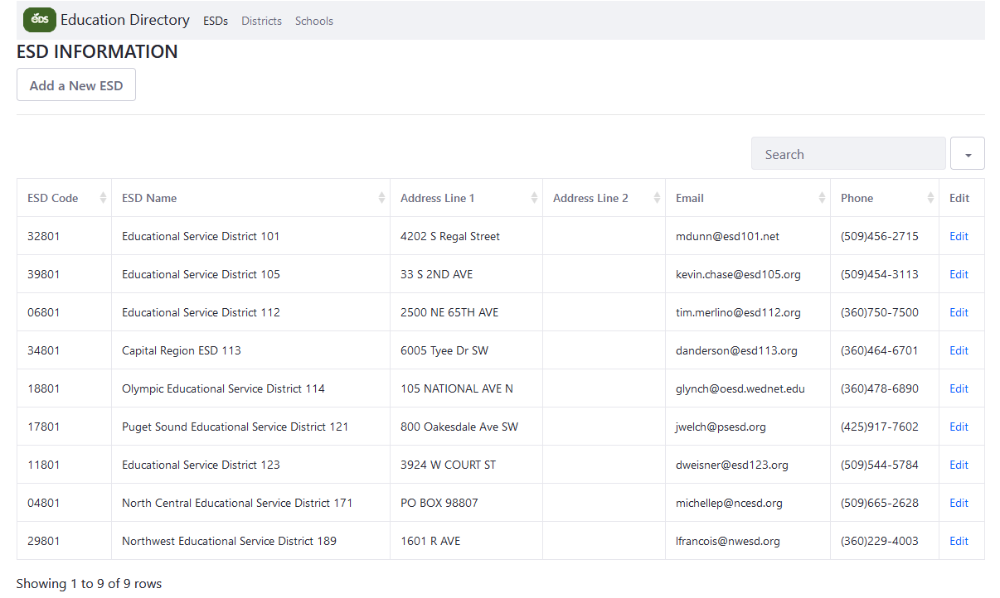

💡Last Updated: 07/26/2022



# What is this for?
> This is an alternative for the Washington State Education Directory located [here](https://eds.ospi.k12.wa.us/DirectoryEDS.aspx). This is not meant for production use as it's only meant to display how the EDS directory would look within a Liferay/Java environment.

# How do you use it?
> When the application is running it will give you an option to upload a CSV generated from the EDS directory site. This application currently assumes that each CSV uploaded for ESDs, Districts, or Schools will be in a particular order. This was the order the EDS directory site exported the CSVs. The CSV should have no more and no less than the following columns for each upload to a table.

### ESDs
| ESD Name | ESD Code | AddressLine1 | AddressLine2 | State | ZipCode | Administrator Name | Phone | Email |
|----------|----------|--------------|--------------|-------|---------|--------------------|-------|-------|
| record-1 | ...      | ...          | ...          | ...   | ...     | ...                | ..    | ..    |
| ...      | ...      | ...          | ...          | ...   | ...     | ...                | ...   | ...   |
| record-n | ...      | ...          | ...          | ...   | ...     | ...                | ...   | ..    |

### Districts
| ESDCode  | ESDName | DistrictCode | DistrictName | AddressLine1 | AddressLine2 | City | State | ZipCode | Administrator Name | Phone | Email |
|----------|---------|--------------|--------------|--------------|--------------|------|-------|---------|--------------------|-------|-------|
| record-1 | ...     | ...          | ...          | ...          | ...          | ...  | ...   | ...     | ...                | ..    | ..    |
| ...      | ...     | ...          | ..           | ...          | ...          | ...  | ...   | ...     | ...                | ...   | ...   |
| record-n | ...     | ...          | ...          | ...          | ...          | ...  | ...   | ...     | ...                | ...   | ..    |

### Schools
| ESDCode  | ESDName | LEACode | LEAName | SchoolCode | SchoolName | LowestGrade | HighestGrade | AddressLine1 | AddressLine2 | City | State | ZipCode | PrincipalName | Email | Phone | OrgCategoryList | AYPCode | GradeCategory |
|----------|---------|---------|---------|------------|------------|-------------|--------------|--------------|--------------|------|-------|---------|---------------|-------|-------|-----------------|---------|---------------|
| record-1 | ...     | ...     | ...     | ...        | ...        | ...         | ...          | ...          | ...          | ...  | ...   | ...     | ...           | ..    | ..    | ...             | ...     | ...           |
| ...      | ...     | ...     | ...     | ...        | ...        | ...         | ..           | ...          | ...          | ...  | ...   | ...     | ...           | ...   | ...   | ...             | ...     | ...           |
| record-n | ...     | ...     | ...     | ...        |            | ...         | ...          | ...          | ...          | ...  | ...   | ...     | ...           | ...   | ..    | ...             | ...     | ...           |

# Who are the primary contacts?
> Developer: Brenton Sablan 

# Where is it located?
> Development: Only in development on local machines

# DEVELOPER NOTES
# What is this built on?
- Java JDK 1.8
- Liferay 7.2
- MySQL
- MySQL Java connector 8.0.29
- Apache Tomcat (Liferay 7.x server)
- Bootstrap 4.0
- [Bootstrap table plugin](https://bootstrap-table.com/)

# How do you run this locally?

## Installations 
### Java JDK 1.8
> You'll need Java JDK 1.8. You should be able to use OpenJDK or Oracle's JDK located on their website. [Oracle JDK download page](https://www.oracle.com/java/technologies/downloads/)

### MySQL Server
> MySQL is used for the database. Downloads are located [here](https://dev.mysql.com/downloads/)

### Install Liferay IDE and workspace
> Liferay IDE is a customized version of the Eclipse IDE. You can find the download [here](https://liferay.dev/-/ide). This should also give you a workspace with a tomcat apache bundle.

## Post Installation Instructions
### MySQL
> Create tables within MySQL by using MySQL workbench or an alternative MySQL IDE. You need to run these commands in order.

```
CREATE DATABASE schooldirectory
```

```
USE schooldirectory
```

```

CREATE TABLE `schooldirectory`.`educationalservicedistricts` (
  `idEducationalServiceDistricts` INT NOT NULL,
  `addressLine1` VARCHAR(200) NULL,
  `addressLine2` VARCHAR(200) NULL,
  `code` VARCHAR(45) NULL,
  `name` VARCHAR(200) NULL,
  `email` VARCHAR(45) NULL,
  `phone` VARCHAR(45) NULL,
  `state` VARCHAR(45) NULL,
  `zipCode` VARCHAR(45) NULL,
  `administratorName` VARCHAR(45) NULL,
  PRIMARY KEY (`idEducationalServiceDistricts`));
  
  CREATE TABLE `schooldirectory`.`districts` (
  `iddistricts` INT NOT NULL AUTO_INCREMENT,
  `addressLine1` VARCHAR(200) NULL,
  `addressLine2` VARCHAR(200) NULL,
  `code` VARCHAR(45) NULL,
  `email` VARCHAR(45) NULL,
  `name` VARCHAR(200) NULL,
  `phone` VARCHAR(45) NULL,
  `state` VARCHAR(45) NULL,
  `city` VARCHAR(45) NULL,
  `zipCode` VARCHAR(45) NULL,
  `administratorName` VARCHAR(45) NULL,
  `esdCode` VARCHAR(45) NULL,
  `esdName` VARCHAR(200) NULL,
  PRIMARY KEY (`iddistricts`));
  
  CREATE TABLE `schooldirectory`.`schools` (
  `idschools` INT NOT NULL AUTO_INCREMENT,
  `addressLine1` VARCHAR(200) NULL,
  `addressLine2` VARCHAR(200) NULL,
  `code` VARCHAR(45) NULL,
  `name` VARCHAR(200) NULL,
  `phone` VARCHAR(45) NULL,
  `state` VARCHAR(45) NULL,
  `city` VARCHAR(45) NULL,
  `zipCode` VARCHAR(45) NULL,
  `aypCode` VARCHAR(45) NULL,
  `esdCode` VARCHAR(45) NULL,
  `esdName` VARCHAR(200) NULL,
  `gradeCategory` VARCHAR(45) NULL,
  `highestGrade` VARCHAR(45) NULL,
  `leaCode` VARCHAR(45) NULL,
  `leaName` VARCHAR(200) NULL,
  `lowestGrade` VARCHAR(45) NULL,
  `orgCategoryList` VARCHAR(45) NULL,
  `principalName` VARCHAR(45) NULL,
  PRIMARY KEY (`idschools`));
```

### Liferay
> Since we use MySQL as the database, you'll need to put the mysql.jar file in the runtime path. The easiest way to do this is to deploy [mysql-connector-java-8.0.29.jar](https://mvnrepository.com/artifact/mysql/mysql-connector-java/8.0.29) in the hot deploy folder located in LIFERAYWORKSPACE/bundles/deploy folder. When the server starts the file will disappear and automatically put into an area where other portlets can use it as a dependency.

> Since this is a portlet (or module) - you'll need to clone this project into the LIFERAYWORKSPACE/modules folder. Use the gradle tasks in eclipse in order to deploy the project. Or you can use any of these ways to [deploy a project](https://help.liferay.com/hc/en-us/articles/360028833832-Deploying-a-Project)
